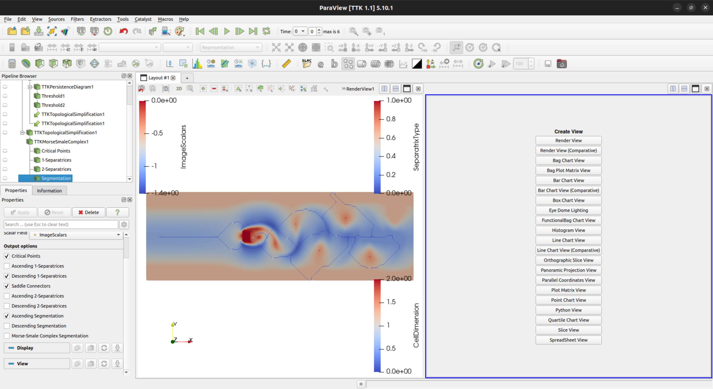
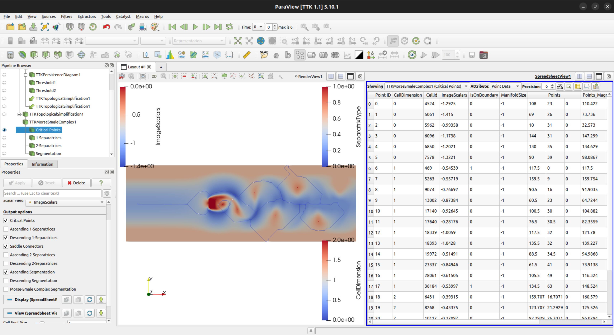

*WIP*
<!-- TODO: Tutorial for computing Morse Complex -->

# Exporting Morse Complex
There are a few ways to construct a `MorseGraph` from a Morse Complex, but this tutorial will cover how to export a Morse Complex from Paraview and use the exported data to construct a `MorseGraph`.

<!-- TODO: Annotate Screenshots -->

1. Open the spreadsheet view
	
	

2. Export spreadsheet for Critical Points point data.
3. Export spreadsheet for Separatrices point data.
4. Export spreadsheet for Separatrices cell data.
5. Construct Morse Graph
	```python
	import pandas as pd

	from mcopt import MorseGraph

	critical_points = pd.read_csv('critical_points.csv')
	separatrices_points = pd.read_csv('separatrices_points.csv')
	separatrices_cells = pd.read_csv('separatrices_cells')

	graph = MorseGraph.from_paraview_df(critical_points, separatrices_points, separatrices_cells)

	...
	```
